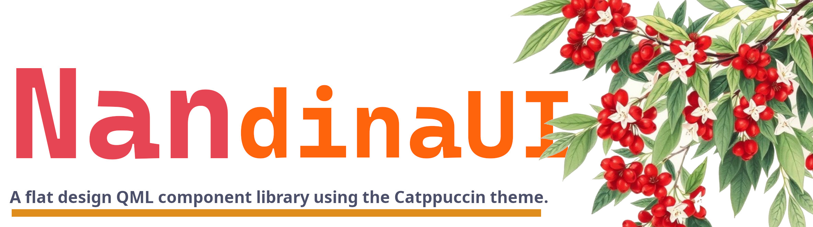

<br>
# NandinaUI 南天竹UI组件
**A flat design QML component library using the Catppuccin theme.**  
**一套使用 Catppuccin 主题的扁平设计 QML 组件库。**

[](https://github.com/Nandina/NandinaUI/releases/latest) 
[](https://github.com/Nandina/NandinaUI/blob/main/LICENSE)
[](https://github.com/Nandina/NandinaUI/releases)
[](https://github.com/Nandina/NandinaUI/issues)

## preview
***正在努力更新中***

## Quick start
1. **clone this repo**
   ``` bash
    git clone https://github.com/CvRain/NandinaUI.git
   ```

2. **build the project**

    You can then see that the directory 'Nandina' has been generated
``` bash
    cd NandinaUI
    mkdir build && cd build
    cmake ..
    make
```
   

3. **build with QtCreator**

    If you open the project with QtCreator for compilation, the project will be generated in build/ your build tool like: `NandinaUI/build/Qt_6_8_1_gcc_64-Debug/NandinaUI`

4. **how to use**
   * You can be compiled folder on your Qt QML directory under the build tools, such as here:`/home/cvrain/Qt/6.8.1_gcc_64/QML`
   * It can also be placed in the project you are using, but seems to need to be configured

5. **notice**
   * Make sure the build version is the same as the version of qt used for development
   * Do not mix Debug and Release library files for development