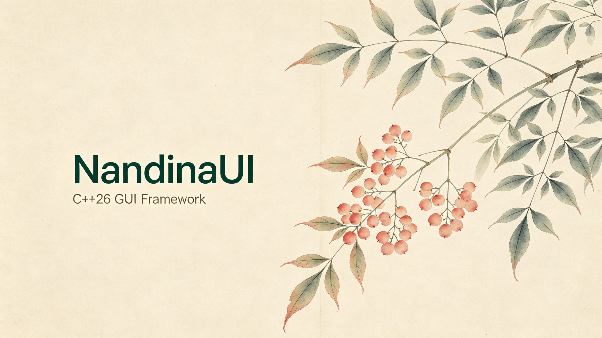
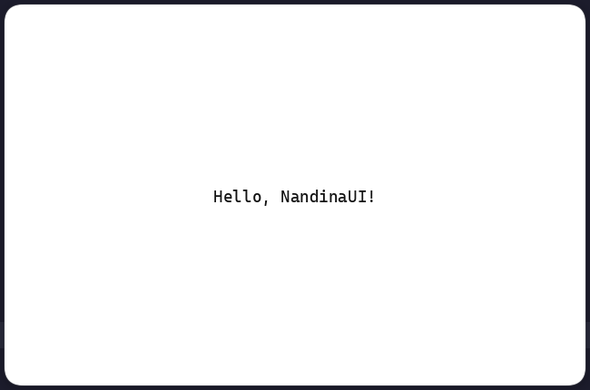

<div align="center">

# NandinaUI · 南天竹

**一个基于 C++26 的桌面 GUI 框架 —— 让编写桌面应用成为一件舒服的事。**

[](LICENSE)
[](release-metadata.toml)
[]()
[](https://github.com/CvRain/NandinaUI/actions/workflows/ci.yml)

</div>

## 简介

NandinaUI（南天竹）是一个用 **C++26** 编写、基于 **Meson** 构建的**原生桌面 UI 框架**。它把「声明式 UI」「响应式状态」「动画」「主题」「资源管理」等现代应用开发体验带进 C++，让你用一套简洁、类型安全的 DSL 构建桌面界面，而无需在繁琐的样板代码之间来回穿梭。  

项目在开发时参考了现有主流框架的设计思路，如 `Angular` 的页面调度与响应式机制、`Shadcn` 的 primitives + token 组件设计、`Slint` 的脏数据更新与文件渲染机制、`Qt` 的新信号槽机制与组件 API 设计。

> 当前处于 **alpha** 阶段，仅支持 `linux-desktop-source` profile（Linux 桌面 · 源码分发）。

## 项目速览

| 项目 | 信息 |
| --- | --- |
| 定位 | 原生桌面 UI 框架（简单、自研、全链路） |
| 语言 / 标准 | C++，`cpp_std=c++26` |
| 构建系统 | Meson（第三方库经 CMake subproject 适配） |
| 许可证 | MIT（Copyright © 2026 ClaudeRainer） |
| 版本 | 0.1.0-alpha.1 |

## ✨ 核心特性

- **声明式 UI DSL** —— 用 `ui.column()`、`ui.center()`、`ui.make<widget::Button>()` 组合出可读的界面树，布局、对齐、间距一链式完成。
- **响应式状态** —— `signal` / `computed` / `effect` / `property` / `batch`，状态变化自动驱动界面更新，告别手动刷新。
- **可组合组件库** —— 覆盖内容展示、输入选择、布局滚动、浮层反馈与通用指针手势，并通过统一主题和声明式构建器组合。
- **动画系统** —— Tween、Spring、关键帧、缓动曲线与动画组，让过渡与动效顺滑自然。
- **现代文本引擎** —— FreeType + HarfBuzz + FriBidi + utf8proc 组成的字形管线，支持多字体、系统字体发现、复杂文字整形与双向文本。
- **主题与设计系统** —— 三层设计令牌（primitive → semantic → component）、明暗外观（Appearance）、内置主题与样式文档。
- **资源系统** —— 资源清单（manifest）+ 内置/目录/内存/SQLite 四类后端，配合 `nanres` 编译器与可移植打包流程。
- **应用运行时** —— 窗口、Router/Page 导航、视口缩放、异步作用域与统一的输入/剪贴板分发。
- **可选 2D 物理** —— 基于 Box2D 3.x 的轻量物理桥（默认关闭）。
- **无障碍语义** —— 控件语义树导出，为可访问性工具铺路。

## 🧱 架构

框架按模块组织：

| 模块 | 职责 |
| --- | --- |
| `foundation` | 颜色、几何、变换、UTF-8、JSON、日志 |
| `reactive` | 信号图、computed/effect、属性绑定 |
| `animation` | Tween/Spring/关键帧/动画组 |
| `text` | 字体加载、字形图集、复杂文本整形 |
| `render` | 渲染设备（raylib 后端）、纹理缓存、SDF 图元 |
| `resource` | 资源清单、多后端、运行时管理 |
| `scene` | 场景树、节点、画布、帧调度 |
| `widget` | 组件库、声明式 DSL、布局原语 |
| `theme` | 设计令牌、主题管理器、样式文档 |
| `app` | 窗口、Router/Page、应用入口 |
| `semantics` | 无障碍语义 |
| `physics2d` | 可选 Box2D 物理桥 |

## 🧩 组件支持

| 类别 | 当前可用 |
| --- | --- |
| 内容与展示 | Label、Image、Avatar、Badge、Chip、Divider、ProgressBar、Card |
| 输入与选择 | Button、Checkbox、Switch、RadioButton/RadioGroup、Slider、TextField、Select、Tabs |
| 浮层与反馈 | Dialog、Tooltip |
| 交互扩展 | PointerArea、GestureArea（实验性） |
| 布局与滚动 | Column、Row、Flex、Wrap、Stack、Padding、Center、Expanded、Grid、ScrollView、ListView |

完整的用途、成熟度与计划组件见 [组件参考](docs/components/README.md)。

## 🚀 快速开始

### 环境要求

- **Linux 桌面**（Wayland | Xorg）
- **编译器**：GCC ≥ 16 或 Clang ≥ 21（需 C++26 支持）
- **构建工具**：Meson、Ninja、CMake、pkg-config、Python 3
- **系统库**：OpenGL、OpenSSL ≥ 3.0、SQLite ≥ 3.37

其余第三方依赖（spdlog、raylib、FreeType、HarfBuzz、FriBidi、utf8proc、toml++、nlohmann/json、Catch2、Box2D 等）均以 Git 子模块方式随仓库提供。

### 创建 C++ 项目
```bash
# 建立项目目录
mkdir nandina_playground
cd nandina_playground

# 初始化项目
meson init --name nandina_playground --language cpp
```

### 将本项目以源码方式导入
```bash
mkdir subprojects
cd subprojects
git clone https://github.com/CvRain/NandinaUI.git --recursive
```

### 编辑 `meson.build`
```meson
project(
  'nandina_playground',
  'cpp',
  version : '0.1',
  meson_version : '>= 1.3.0',
  default_options : ['warning_level=3', 'cpp_std=c++26'],
)

nandina = subproject(
    'NandinaUI',
    default_options: ['build_tests=false', 'physics2d=disabled'],
)
nandina_dep = nandina.get_variable('nandina_dep')

dependencies = [
    nandina_dep
]

sources = [
  'nandina_playground.cpp',
]

exe = executable(
  'nandina_playground',
  sources,
  install : true,
  dependencies : dependencies,
)

test('basic', exe)

```


### 编辑 `nandina_playground.cpp`
```cpp
#include <nandina/app/nan_application.hpp>
#include <nandina/widget/controls.hpp>

using namespace nandina;

auto main() -> int {
    return app::run(
        app::RunConfig {
            .id = "com.example.hello",
            .window = {
                .title = "Hello NandinaUI",
                .width = 640,
                .height = 420,
            },
        },
        [](const widget::BuildContext& ui) {
            return ui.center()
                .child(ui.make<widget::Label>("Hello, NandinaUI!"))
                .build();
        }
    );
}
```

### 构建
```bash
meson setup buildDir --wrap-mode=nodownload
meson compile -C buildDir
```

### 运行
```bash
./buildDir/nandina_playground
```


## 📚 文档

- [入门指南](docs/getting_started/README.md)：从项目认识、创建窗口到布局、响应式状态和 Page 导航。
- [组件参考](docs/components/README.md)：组件清单、公开 API、使用方式与交互规则。
- [开发参考](docs/references/README.md)：组件契约、架构约束和维护流程。
- [组件开发路线图](docs/references/component_roadmap.md)：当前差距、依赖关系与推荐实现顺序。

## 🗺️ 开发计划

项目当前处于 alpha 阶段，近期工作优先保证公共 API 的一致性，而不是单纯增加组件数量。

- [x] 建立声明式 UI、响应式状态、主题、动画、资源和 Page/Router 基础。
- [x] 支持 Linux Wayland 与 X11，并提供 PointerArea / GestureArea 组合式交互。
- [x] 建立组件公共契约、组件文档与开发参考目录。
- [x] 建立 OverlayHost/portal 的内容层、顶层层级和 RAII 生命周期基础。
- [x] 补齐浮层锚点定位、边界翻转和视口内收。
- [ ] 补齐点击外部关闭和焦点作用域等浮层基础设施。
- [ ] 将 Select、Tooltip、Dialog 迁移到统一浮层设施并保持应用层 API 兼容。
- [ ] 补充 TextArea、Toggle、Alert、Spinner、Skeleton、EmptyState 等高频组件。
- [ ] 基于统一浮层实现 Popover、Menu、Combobox 和 CommandPalette。
- [ ] 后续完善 Table/DataTable、Accordion、Sheet 等复合组件。

路线图会随着基础设施成熟度调整；Getting Started 只采用推荐 API，实验性能力会在组件文档中明确标注。


## 外部依赖一览

| 类别 | 依赖 |
| --- | --- |
| 渲染 | raylib（GPU 后端，支持 JPG 等格式） |
| 文本 | FreeType、HarfBuzz、FriBidi、utf8proc |
| 数据 / 配置 | nlohmann/json、toml++、SQLite3 |
| 其他 | spdlog（日志）、OpenSSL（资源签名）、Box2D（可选物理）、Catch2（测试） |


## 📄 许可证

本项目以 [MIT License](LICENSE) 开源。
