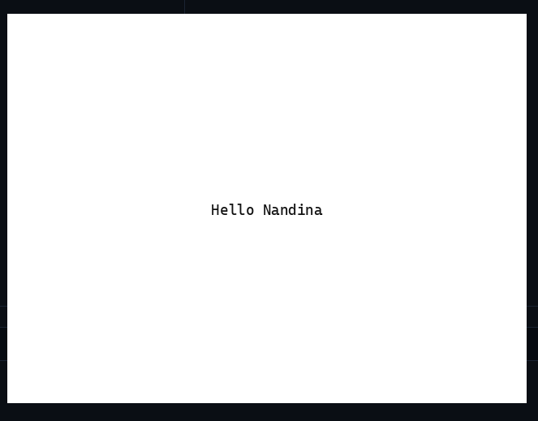

# 创建第一个窗口

上一章准备好了工程与依赖，这一章将第一次真正运行 NandinaUI。我们会从一个最小的单窗口应用出发：配置应用标识与窗口参数，在根视图工厂中创建一个简单控件，然后把窗口交给框架的应用循环。屏幕上出现的内容虽然不多，却已经完整走过了应用初始化、页面托管、控件树构建、布局与渲染流程。

这一章的重点不是一次介绍所有应用层能力，而是建立一个可靠的程序入口。开发者需要理解哪些对象由框架创建、哪些配置属于窗口，以及为什么根视图通过 `widget::BuildContext` 构建。后面的按钮、布局和信号章节都会直接在这个窗口上继续扩展。

## 本章目标

- 使用 `app::RunConfig` 描述应用标识和窗口配置。
- 通过 `app::run` 启动一个普通单窗口应用。
- 使用 `widget::BuildContext` 创建并返回根视图。
- 理解 `WindowConfig` 中标题、尺寸、帧率和窗口行为等常用字段。
- 掌握配置、构建、运行和关闭应用的最短流程。

## 1. 使用 Meson 创建一个 C++ 应用

### 创建应用

创建一个 NandinaUI 窗口应用并不困难。选择一个合适的位置创建目录，然后使用 `meson` 命令生成一个普通的 C++ 项目：
```bash
mkdir first_window && cd first_window
meson init --name first_window --language cpp
```

生成完成后，项目中会看到 `first_window.cpp` 和 `meson.build` 两个文件。Meson 的模板内容大致如下：

**`meson.build`**
```meson
project(
  'first_window',
  'cpp',
  version : '0.1',
  meson_version : '>= 1.3.0',
  default_options : ['warning_level=3', 'cpp_std=c++14'],
)

dependencies = [
]

sources = [
  'first_window.cpp',
]

exe = executable(
  'first_window',
  sources,
  install : true,
  dependencies : dependencies,
)

test('basic', exe)
```

这里的 `test('basic', exe)` 会把可执行文件注册为 Meson 测试目标。它不是运行窗口所必需的；如果你的程序需要图形桌面环境，入门阶段直接运行生成的可执行文件通常更直观，后续也可以按项目需要保留或移除这一行。

**`first_window.cpp`**
```cpp
#include <iostream>

#define PROJECT_NAME "first_window"

int main(int argc, char **argv) {
    if (argc != 1) {
        std::cout << argv[0] << " takes no arguments.\n";
        return 1;
    }
    std::cout << "This is project " << PROJECT_NAME << ".\n";
    return 0;
}
```

## 2. 修改 `meson.build`

### 设置 C++ 标准

Meson 模板默认使用较旧的 C++ 标准，而 NandinaUI 要求 C++26。先将项目默认选项修改为：

```meson
  default_options : ['warning_level=3', 'cpp_std=c++26'],
```

### 添加 NandinaUI 子项目

Meson 会从当前项目的 `subprojects/` 目录查找子项目。创建目录后，将 NandinaUI 以 Git 子模块或其他方式放入其中。下面的命令会将仓库克隆到 `subprojects/NandinaUI`：

```bash
mkdir subprojects
git -C subprojects clone https://github.com/CvRain/NandinaUI.git NandinaUI --recursive
```

接着在 `meson.build` 中声明子项目，并从它取得框架导出的依赖对象 `nandina_dep`。对于应用项目，通常关闭 NandinaUI 自身的测试和可选物理模块，可以减少首次配置的构建内容：

完整的 `meson.build` 参考如下：
```meson
project(
  'first_window',
  'cpp',
  version : '0.1',
  meson_version : '>= 1.3.0',
  default_options : ['warning_level=3', 'cpp_std=c++26'],
)

nandina = subproject(
    'NandinaUI',
    default_options: ['build_tests=false', 'physics2d=disabled'],
)
nandina_dep = nandina.get_variable('nandina_dep')

dependencies = [
    nandina_dep
]

sources = [
  'first_window.cpp',
]

exe = executable(
  'first_window',
  sources,
  install : true,
  dependencies : dependencies,
)

test('basic', exe)
```

## 3. 修改 `first_window.cpp`

现在可以用几行代码启动窗口。这个示例创建一个居中的标签，暂时不涉及按钮、布局组合和响应式状态；后续章节会在此基础上逐步扩展。

```cpp
#include <nandina/app/nan_application.hpp>
#include <nandina/widget/controls.hpp>

int main() {
  return nandina::app::run(
      nandina::app::RunConfig{.id = "com.nandina.getting_started",
                              .window =
                                  nandina::app::WindowConfig{
                                      .title = "Hello nandina",
                                      .width = 640,
                                      .height = 480,
                                  }},
      [](const nandina::widget::BuildContext& ui) {
        return ui.center()
            .child(ui.make<nandina::widget::Label>("NandinaUI is running"))
            .build();
      });
}
```

### 代码分析

整个程序只有一个入口函数和一个根视图工厂。如果你愿意，也可以使用 `using namespace nandina;` 缩短类型名称；教程中保留完整命名空间，是为了让每个类型属于哪个模块一目了然。

窗口的启动入口是 `nandina::app::run()`。它接收两个参数：`RunConfig` 和根视图工厂 `Factory`。

`RunConfig` 描述启动所需的应用与窗口信息：

- `.id` 是应用在进程和资源服务中的身份标识，通常使用反向域名形式，例如 `com.nandina.getting_started`。
- `.window` 是 `WindowConfig`，可以配置标题、宽高、目标帧率、装饰边框、可调整大小、垂直同步和高 DPI 等行为。
- 未显式设置的字段使用框架提供的合理默认值，因此最小程序不需要填写一长串配置。

第二个参数是根视图工厂。框架会在页面建立时调用它，并传入一个 `BuildContext`。你可以通过这个上下文创建控件、组合布局、注册响应式状态和绑定；工厂最终返回一个控件构建器或实际的节点对象，作为窗口的根视图。

这里的 `ui` 是构建阶段使用的轻量上下文，并不是一个需要手动释放的全局对象，也不应该保存到构建函数之外。它背后的响应式作用域由框架管理，后续章节会看到它如何帮助控件安全地管理回调和绑定。

## 4. 运行程序

在项目根目录执行：

```bash
meson setup buildDir --wrap-mode=nodownload
meson compile -C buildDir
./buildDir/first_window
```

如果 `buildDir` 已经存在，只需要重新编译即可。第一次配置会编译 NandinaUI 及其依赖，因此可能比之后的增量构建花费更多时间。

## 5. 运行机制

调用 `app::run()` 后，框架会创建 `NanApplication`，初始化响应式图、主题、资源和字体等应用级服务，然后创建窗口与内部路由器。根视图工厂会被包装成默认的根页面并压入路由栈，返回的控件树随后被挂载到窗口的场景树中。

窗口打开后，`NanApplication` 进入主循环。每一帧大致会经历输入分发、节点处理、动画推进、布局计算和绘制；用户关闭窗口后，循环结束并按相反方向释放窗口、页面、控件及其响应式作用域。

这也是为什么示例不需要自己编写窗口循环、输入轮询或资源清理代码：应用层负责生命周期，控件树负责界面结构，渲染层负责把最终结果绘制出来。

## 6. 生命周期与所有权

- `app::run()` 创建并持有本次运行所需的 `NanApplication`，函数返回时应用服务统一销毁。
- 根视图由页面/路由和场景树共同持有；你通常只需要返回构建结果，不需要手动 `delete`。
- `BuildContext` 是非拥有的构建服务视图，不能脱离所属构建作用域长期保存。
- 通过上下文创建的信号、计算值、效果和绑定属于当前作用域；组件离开树或页面销毁时，框架会清理这些订阅关系。
- 如果使用 `app::NanApplication`、`app::NanWindow` 等显式 API，则由外层对象负责保证应用对象比窗口和控件活得更久。


## 最后

完成一次编译并运行后，你应该会看到一个标题为 `Hello nandina` 的窗口，其中显示 `NandinaUI is running`。这就是一个完整的 NandinaUI 应用：它已经拥有应用身份、窗口配置、根页面、控件树和主循环，只是目前界面还很简单。



完整代码就是本章前面给出的 `first_window.cpp` 示例；后续章节会继续在它的基础上修改。


## 本章涉及的核心 API

- `<nandina/app/nan_application.hpp>` 与 `<nandina/widget/controls.hpp>`。
- `RunConfig::id` 与桌面应用身份的意义。
- `WindowConfig` 的默认值及常用自定义项。
- 根视图工厂的调用时机和返回值要求，以及 `ui.center().child(...).build()` 的基本组合方式。
- `NanApplication`、内部根页面与窗口主循环之间的职责边界。

> 本章只负责建立程序入口和窗口认知。下一章将在这个窗口中加入按钮，让界面开始响应用户操作。
