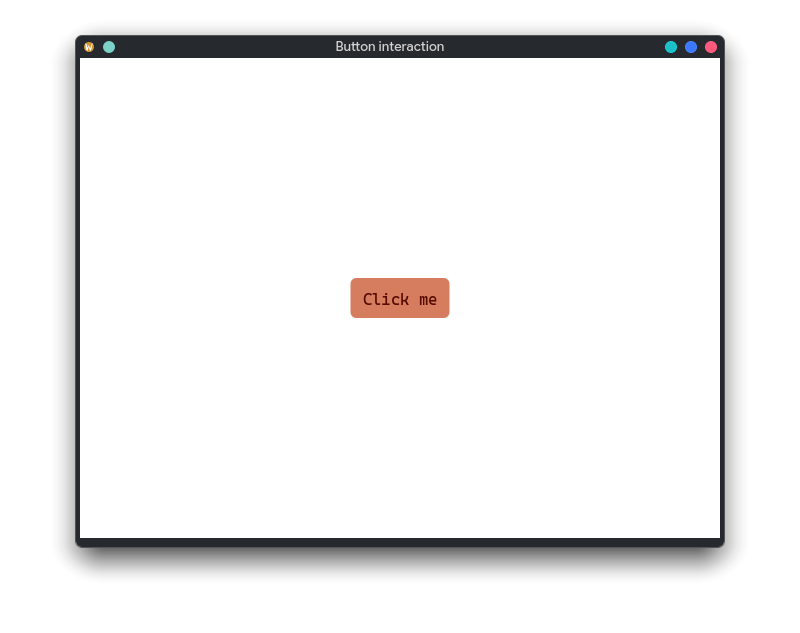
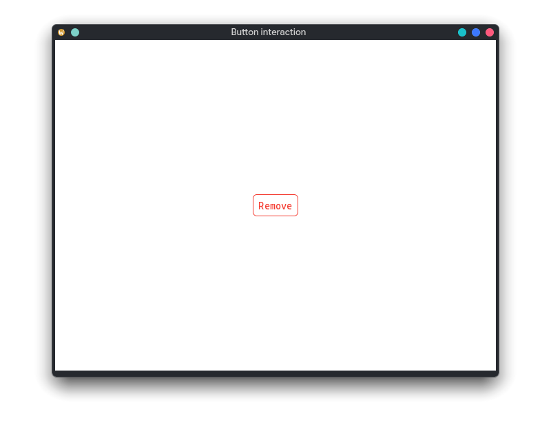

# 添加一个按钮

上一章中的标签只能展示内容。这一章会加入第一个真正能够响应用户操作的控件：`widget::Button`。我们将让按钮在激活时输出一条日志，并借此认识 NandinaUI 如何创建语义控件、注册回调，以及根据设计系统选择按钮外观。

Button 的使用入口很小，但它并不是只会接收鼠标点击的矩形。框架会统一维护悬停、按下、焦点与禁用状态，并允许鼠标、键盘和无障碍操作触发同一个“激活”行为。应用只需描述按钮应该做什么，不必自己判断每一种输入设备。

## 本章目标

- 使用 `ui.make<widget::Button>()` 创建按钮。
- 通过 `.on_click()` 响应按钮的语义激活。
- 使用 `tone`、`treatment` 和 `ButtonSize` 选择基础外观。
- 理解 press、release、cancel 与 click 的区别。
- 了解组件固有语义与附加手势之间的边界。

## 1. 创建按钮

先将上一章根视图中的 Label 替换为 Button：

```cpp
#include <nandina/app/nan_application.hpp>
#include <nandina/foundation/nan_logger.hpp>
#include <nandina/widget/controls.hpp>

int main() {
  using namespace nandina;

  return app::run(
      app::RunConfig{
          .id = "com.nandina.getting_started",
          .window = app::WindowConfig{
              .title = "Button interaction",
              .width = 640,
              .height = 480,
          },
      },
      [](const widget::BuildContext& ui) {
        return ui.center()
            .child(ui.make<widget::Button>("Click me").on_click([] {
              log::info("The button was activated");
            }))
            .build();
      });
}
```

重新编译并运行程序。单击按钮后，终端会打印日志。将焦点移动到按钮，再按 Enter 或 Space，也会执行同一个回调。



`ui.make<widget::Button>("Click me")` 创建 Button 及其声明式构建器；`.on_click(...)` 为控件安装行为；外层 `.build()` 最终返回根视图。传给 `.child()` 的按钮构建器会由框架自动物化，因此这里不需要额外调用一次 `.build()`。

## 2. 按钮的`click`事件
`on_click` 沿用桌面与 Web UI 中熟悉的名称，但它表达的是按钮的主要语义行为：`激活`。

以下输入都可以激活 Button：

- 鼠标主键完成一次有效点击；
- 键盘 Enter 或 Space；
- 语义树发出的无障碍 activate 操作。

因此，回调中应该放置“保存”“确认”“打开”等业务动作，而不是依赖鼠标坐标的逻辑。需要读取指针位置、识别双击或拖拽
等一些复杂或自定义事件时应使用 `PointerArea` 或 `GestureArea`，
而不是基于Button在组件上堆叠更多的动作，或者削弱 Button 的跨输入设备语义。

## 3. 一次点击的生命周期

Button 还提供更细的交互回调：

```cpp
auto button = ui.make<widget::Button>("Hold me")
    .on_press([] { log::info("pressed"); })
    .on_release([] { log::info("released"); })
    .on_cancel([] { log::info("cancelled"); })
    .on_hover_changed([](bool hovered) {
      log::info(hovered ? "pointer entered" : "pointer left");
    })
    .on_focus_changed([](bool focused) {
      log::info(focused ? "focused" : "unfocused");
    });
```

`press` 表示主指针在按钮上按下，`release` 表示一次按压在有效区域内正常释放。如果按下后移出按钮、控件被禁用或焦点中断，本次交互会产生 `cancel`，并且不会触发 `click`。

大多数业务代码只需要 `on_click`。这些生命周期回调更适合实现按压反馈、按住预览等细节，不应该用它们重新拼装一次普通点击。

## 4. 选择按钮外观

NandinaUI 用语义属性选择按钮外观，而不是要求每个按钮重复指定颜色：

```cpp
auto remove = ui.make<widget::Button>("Remove")
    .tone(theme::ButtonTone::danger)
    .treatment(theme::ButtonTreatment::outlined)
    .configure([](widget::Button& button) {
      button.set_button_size(theme::ButtonSize::small);
    })
    .on_click([] { log::info("remove requested"); });
```



- `ButtonTone` 表达操作的色彩语义，包括 `primary`、`secondary`、`neutral` 和 `danger`。
- `ButtonTreatment` 表达视觉强调方式，包括 `filled`、`tonal`、`outlined`、`ghost` 和 `link`。
- `ButtonSize` 提供 `small`、`medium` 和 `large` 三个设计系统档位。

这些值会经过当前主题解析，所以切换亮色、暗色或自定义主题时，按钮仍能保持一致的层级与对比度。特殊实例确实可以通过视觉属性微调圆角和文字颜色，但设计系统级选择应优先使用这些语义属性。
关于如何自定义调色盘和主题风格，请参考后续章节。

## 5. 声明式构建器与直接配置

构建器提供常用操作的链式入口：

```cpp
auto button = ui.make<widget::Button>("Save")
    .tone(theme::ButtonTone::primary)
    .on_click(save);
```

当某个接口没有专门的链式方法，或者需要集中执行多项底层设置时，可以使用 `.configure()`：

```cpp
auto button = ui.make<widget::Button>("Save")
    .configure([](widget::Button& value) {
      value.set_button_size(theme::ButtonSize::large);
      value.set_disabled(false);
    })
    .on_click(save);
```

已经持有 `std::shared_ptr<Button>` 时，也可以直接调用 `set_on_click()` 等成员函数。对于新建视图，构建器能让结构、外观与行为保持在同一处，通常更容易阅读。

## 6. 回调的生命周期

通过 `BuildContext` 创建的构建器会保护应用回调的生命周期。当所属页面或构建作用域已经销毁，即使外部代码暂时仍持有控件对象，旧回调也不会再次进入已经失效的页面状态。

这并不意味着可以随意捕获悬空引用：回调捕获的普通 C++ 对象仍需遵守语言自身的生命周期规则。页面成员、由作用域拥有的信号以及寿命明确长于页面的服务通常是安全的；对短期局部变量使用引用捕获时仍需格外谨慎。

## 7. 为什么 Button 没有所有手势

双击、长按和拖拽并不是 Button 独有的语义，Label、Image、Card 或自定义控件同样可能需要它们。NandinaUI 不会为每个组件复制一整套手势 API，而是使用透明的交互区域扩展任意内容：

```cpp
return ui.make<widget::GestureArea>()
    .on_double_click([](const scene::MouseButtonEvent&) {
      log::info("label double-clicked");
    })
    .child(ui.make<widget::Label>("Double-click me"))
    .build();
```

Button 默认只承担一个按钮应该具备的语义；额外的指针与手势能力通过组合获得。这样既保持基础组件简单，也避免高级交互受组件类型限制。完整模型见 [PointerArea 与 GestureArea](../components/pointer_and_gesture_areas.md)。

## 最后

现在窗口已经能够响应真实操作。Button 将视觉状态、焦点、键盘与无障碍激活统一成一个简洁的应用接口，而构建器负责将配置和回调放在控件声明附近。

下一章会在窗口中加入多个控件，并使用布局系统组织它们。第五章再把日志替换为响应式状态，让按钮真正改变界面内容。

## 本章涉及的核心 API

- `widget::Button` 与底层 `primitives::Pressable`。
- `NodeBuilder::on_click()`、`on_press()`、`on_release()` 和 `on_cancel()`。
- `ButtonTone`、`ButtonTreatment` 与 `ButtonSize`。
- `NodeBuilder::configure()` 和 `build()`。
- `PointerArea`、`GestureArea` 与语义控件的职责边界。
